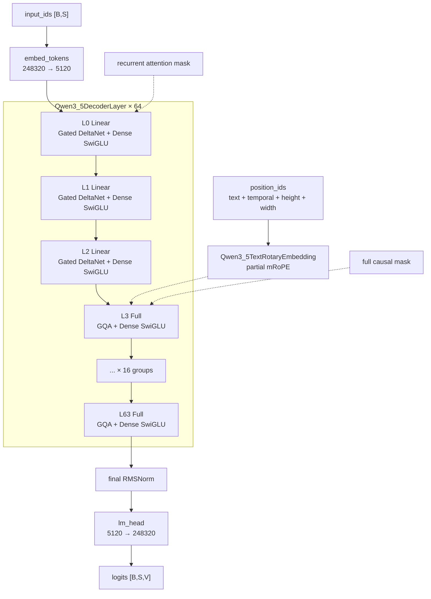
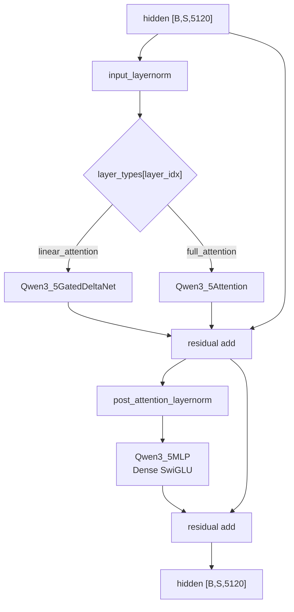
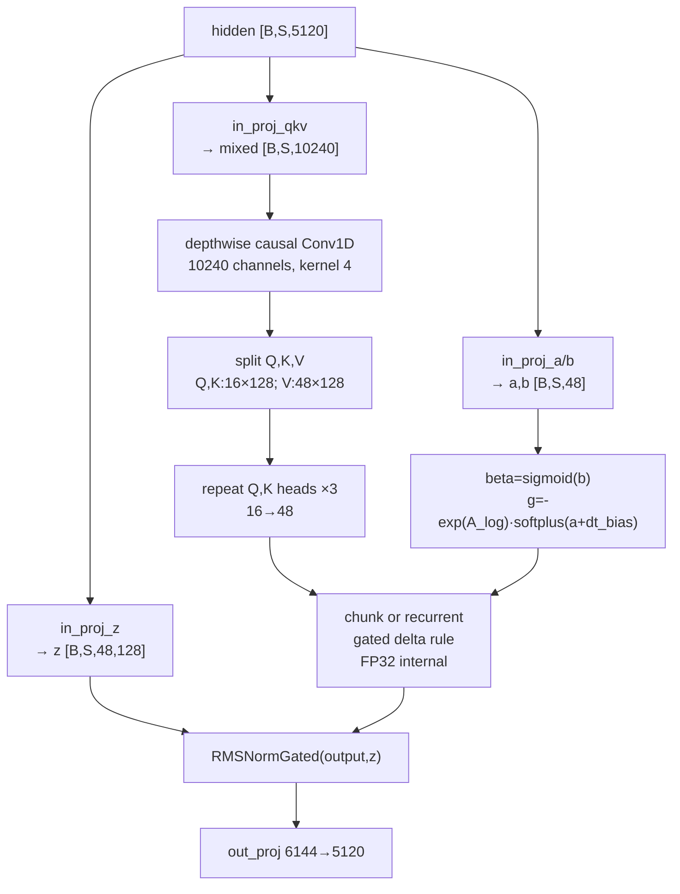

# Qwen3.6-27B-FP8 架构结构图（ASC）

> 基于官方 [`Qwen3.6-27B-FP8-config.json`](./config/Qwen3.6-27B-FP8-config.json)
> 与本地保存的 Hugging Face Transformers `main` 分支代码核对。  
> 本地参考代码：
> `docs/Qwen_3.6/reference/qwen3_5/{configuration_qwen3_5.py,modeling_qwen3_5.py,modular_qwen3_5.py}`。  
> checkpoint 的 `model_type=qwen3_5`、文本配置
> `model_type=qwen3_5_text`。本文件只分析文本 decoder 主路径；visual
> encoder 与 MTP 单独标注，但不进入性能计算。  
> 状态：模型结构分析、算力/显存和工程口径已确认。

---

## 1. 顶层结构（Top-level）

文本生成使用 `Qwen3_5ForCausalLM`，其核心部件为：

| 组件 | Transformers 类型 | 维度 / 说明 |
|---|---|---|
| `model.embed_tokens` | `nn.Embedding` | 248320 → 5120 |
| `model.layers` | `ModuleList[Qwen3_5DecoderLayer]` | 共64层 |
| `model.norm` | `Qwen3_5RMSNorm` | 最终RMSNorm |
| `model.rotary_emb` | `Qwen3_5TextRotaryEmbedding` | 文本/mRoPE位置编码 |
| `lm_head` | `nn.Linear` | 5120 → 248320 |

`Qwen3_5ForCausalLM._keys_to_ignore_on_load_unexpected`明确忽略
`mtp.*`和`model.visual.*`，因此文本CausalLM路径不会实例化这两部分。

数据流：

```text
input_ids [B,S]
  → embed_tokens [B,S,5120]
  → 64 × Qwen3_5DecoderLayer
  → final RMSNorm
  → lm_head
  → logits [B,S,248320]
```

### 1.1 关键超参

| config字段 | 值 | 含义 |
|---|---:|---|
| `hidden_size` | 5120 | hidden维度D |
| `num_hidden_layers` | 64 | decoder层数L |
| `intermediate_size` | 17408 | dense SwiGLU中间维度I |
| `num_attention_heads` | 24 | Full GQA query heads |
| `num_key_value_heads` | 4 | Full GQA KV heads |
| `head_dim` | 256 | Full GQA单头维度c |
| `linear_num_key_heads` | 16 | DeltaNet key heads |
| `linear_key_head_dim` | 128 | DeltaNet key head dim |
| `linear_num_value_heads` | 48 | DeltaNet value heads |
| `linear_value_head_dim` | 128 | DeltaNet value head dim |
| `linear_conv_kernel_dim` | 4 | depthwise Conv1D kernel |
| `mamba_ssm_dtype` | `float32` | recurrent计算/状态口径 |
| `max_position_embeddings` | 262144 | 最大文本上下文 |
| `vocab_size` | 248320 | 词表 |
| `hidden_act` | `silu` | SwiGLU及Conv激活 |
| `rms_norm_eps` | 1e-6 | RMSNorm epsilon |
| `tie_word_embeddings` | false | embedding与lm_head不共享 |
| `mtp_num_hidden_layers` | 1 | MTP元数据，本分析不计 |
| `dtype` | `bfloat16` | checkpoint主dtype |

### 1.2 架构判定：Dense，不是MoE

官方配置中不存在：

```text
num_experts
num_experts_per_tok
moe_intermediate_size
shared_expert_intermediate_size
```

源码 `Qwen3_5DecoderLayer.__init__` 无条件实例化：

```python
self.mlp = Qwen3_5MLP(config, config.intermediate_size)
```

而不是SparseMoE模块。因此该模型是hybrid attention + dense FFN。

### 1.3 注意力层schedule

官方`layer_types`显式包含64项，按以下周期排列：

```text
[linear_attention, linear_attention, linear_attention, full_attention] × 16
```

| layer type | 层数 | 索引 |
|---|---:|---|
| `linear_attention` | 48 | 0–2, 4–6, ..., 60–62 |
| `full_attention` | 16 | 3, 7, 11, ..., 63 |

---

## 2. 架构总览图

### 2.1 Mermaid



### 2.2 ASCII

```text
Qwen3_5ForCausalLM
┌───────────────────────────────────────────────────────────────────┐
│ input_ids [B,S]                                                   │
│   │                                                               │
│   ▼                                                               │
│ embed_tokens 248320→5120                                          │
│   │ hidden [B,S,5120]                                             │
│   ▼                                                               │
│ ┌───────────────────────────────────────────────────────────────┐ │
│ │ 64 decoder layers                                             │ │
│ │                                                               │ │
│ │ group 0: L0 Linear → L1 Linear → L2 Linear → L3 Full         │ │
│ │ group 1: L4 Linear → L5 Linear → L6 Linear → L7 Full         │ │
│ │ ...                                                           │ │
│ │ group15: L60 Linear → L61 Linear → L62 Linear → L63 Full     │ │
│ │                                                               │ │
│ │ every layer:                                                  │ │
│ │   pre-norm → token mixer → residual                           │ │
│ │   pre-norm → dense SwiGLU FFN → residual                      │ │
│ └───────────────────────────────────────────────────────────────┘ │
│   │                                                               │
│   ▼                                                               │
│ final RMSNorm → lm_head 5120→248320 → logits [B,S,V]              │
└───────────────────────────────────────────────────────────────────┘
```

---

## 3. 单个 `Qwen3_5DecoderLayer` 内部残差

源码位置：`modeling_qwen3_5.py:765`。

### 3.1 Mermaid



### 3.2 ASCII与forward对应

```text
residual = hidden
hidden = input_layernorm(hidden)

if block_type == linear_attention:
    mixed = linear_attn(hidden, cache_params, recurrent_mask)
else:
    mixed = self_attn(hidden, full_causal_mask, position_embeddings, cache)

hidden = residual + mixed

residual = hidden
hidden = post_attention_layernorm(hidden)
hidden = dense_mlp(hidden)
hidden = residual + hidden
```

该结构是标准单流Pre-Norm残差，不存在DeepSeek V4的mHC多流混合。

---

## 4. `Qwen3_5Attention`：Full GQA

源码位置：`modeling_qwen3_5.py:654`。

### 4.1 投影与维度

```text
input hidden [B,S,5120]

q_proj: 5120 → 24 × 256 × 2 = 12288
  split → Q [B,S,24,256]
       + gate [B,S,24,256] → flatten [B,S,6144]

k_proj: 5120 → 4 × 256 = 1024
v_proj: 5120 → 4 × 256 = 1024

o_proj: 24 × 256 = 6144 → 5120
```

`q_proj`的双倍输出不是额外KV，而是`query_states`与attention output
gate。核心attention输出先乘`sigmoid(gate)`，再进入`o_proj`。

### 4.2 Q/K Norm、RoPE与GQA

```text
Q → per-head RMSNorm → partial RoPE
K → per-head RMSNorm → partial RoPE
V → 不做RoPE

4 KV heads
  → repeat_kv × (24/4=6)
  → 24 query heads
```

### 4.3 Eager attention

源码`eager_attention_forward`：

```text
scores = Q @ Kᵀ / sqrt(256)
scores += causal_mask
prob = softmax(scores, dtype=float32).to(query_dtype)
attn = prob @ V
attn = attn × sigmoid(gate)
out = o_proj(attn)
```

### 4.4 单层FLOPs模板

```text
F_Qgate = 2 · S · D · (2 · n_h · c)
F_K     = 2 · S · D · n_kv · c
F_V     = 2 · S · D · n_kv · c
F_core  = 2 · S² · n_h · c
F_O     = 2 · S · n_h · c · D
```

`F_core`按causal平均有效pair近似：QK和AV合计
`4 × (S²/2) × n_h × c = 2S²n_hc`。

---

## 5. `Qwen3_5GatedDeltaNet`

源码位置：`modeling_qwen3_5.py:395`。

### 5.1 核心维度

```text
n_k_heads = 16, c_k = 128 → key_dim = 2048
n_v_heads = 48, c_v = 128 → value_dim = 6144
conv_dim = 2·key_dim + value_dim = 10240
```

投影：

| 模块 | 输入→输出 |
|---|---|
| `in_proj_qkv` | 5120→10240 |
| `in_proj_z` | 5120→6144 |
| `in_proj_b` | 5120→48 |
| `in_proj_a` | 5120→48 |
| `conv1d` | 10240-channel depthwise, kernel=4 |
| `out_proj` | 6144→5120 |

### 5.2 Mermaid



### 5.3 Prefill与decode分支

```text
Prefill / multi-token:
  causal_conv1d_fn
  chunk_gated_delta_rule

Single-token cached decode:
  causal_conv1d_update (in-place conv_state)
  recurrent_gated_delta_rule (in-place recurrent evolution)
```

fallback实现将Q/K/V、beta和g转为FP32进行chunk/recurrent计算，最后
把输出转回初始dtype。

### 5.4 Recurrent state

每个linear layer维护：

```text
conv_state:
  [B, conv_dim, kernel]
  = [B,10240,4]

recurrent_state:
  [B, n_v_heads, c_k, c_v]
  = [B,48,128,128]
```

recurrent state的每层元素数：

```text
48 × 128 × 128 = 786432 elements
```

### 5.5 单层FLOPs模板

```text
F_qkv  = 2 · S · D · conv_dim
F_z    = 2 · S · D · value_dim
F_ab   = 2 · S · D · (2 · n_v_heads)
F_conv = 2 · kernel · S · conv_dim
F_scan = 2 · S · n_v_heads · c_k · c_v
F_O    = 2 · S · value_dim · D
```

---

## 6. `Qwen3_5MLP`：Dense SwiGLU

源码位置：`modeling_qwen3_5.py:729`。

```text
gate_proj: 5120 → 17408
up_proj:   5120 → 17408
down_proj: 17408 → 5120

output = down_proj( SiLU(gate_proj(x)) · up_proj(x) )
```

单层：

```text
F_gate = 2 · S · D · I
F_up   = 2 · S · D · I
F_down = 2 · S · I · D
F_FFN  = 6 · S · D · I
```

此处没有router、top-k、expert、shared expert和expert parallel。

---

## 7. Cache设计

`Qwen3_5TextModel.forward`在`use_cache=true`且未传cache时创建：

```python
DynamicCache(config=self.config)
```

然后按layer type维护两类状态。

| layer type | 持久状态 |
|---|---|
| Full GQA | K cache + V cache |
| Gated DeltaNet | conv state + recurrent state |

### 7.1 Full GQA KV cache

每层：

```text
K [B,n_kv,S_ctx,c]
V [B,n_kv,S_ctx,c]
```

BF16下：

```text
M_full_kv_per_layer
  = B · 2 · n_kv · S_ctx · c · 2 bytes
```

### 7.2 Linear state

每层：

```text
M_conv = B · conv_dim · kernel · 2 bytes
M_recurrent = B · n_v_heads · c_k · c_v · 4 bytes
```

recurrent state不随context长度增长，是DeltaNet的长上下文优势。

---

## 8. RoPE与位置编码

官方配置：

```text
rope_type = default
rope_theta = 10000000
partial_rotary_factor = 0.25
mrope_interleaved = true
mrope_section = [11,11,10]
```

`Qwen3_5TextModel.forward`在纯文本输入时仍构造4路position IDs：

```text
[text, temporal, height, width]
```

随后：

- `text_position_ids`用于causal mask；
-其余3路用于mRoPE位置嵌入；
- `Qwen3_5TextRotaryEmbedding`生成cos/sin；
- `apply_rotary_pos_emb`只旋转配置指定的前部维度；
- Gated DeltaNet不使用Full GQA的KV RoPE cache。

head dim 256、partial ratio 0.25，对应约64个rotary dimensions。

---

## 9. `Qwen3_5TextModel.forward`数据流

源码位置：`modeling_qwen3_5.py:1147`。

```text
input_ids / inputs_embeds（二选一）
  │
  ├─ embed_tokens
  ├─ 若use_cache且无cache：DynamicCache(config)
  ├─ 构造4路position_ids
  ├─ 构造mask mapping:
  │    full_attention   → create_causal_mask
  │    linear_attention → create_recurrent_attention_mask
  ├─ rotary_emb(hidden, position_ids)
  └─ for layer in layers:
       decoder_layer(
         hidden,
         position_embeddings,
         mask[layer_type],
         past_key_values
       )
  → final norm
```

这说明页面与公式策略必须根据layer type分别追溯Full和Linear路径，
不能把64层全部当成普通GQA。

---

## 10. FP8量化与部署

### 10.1 官方量化配置

```text
quant_method       = fp8
fmt                = e4m3
activation_scheme  = dynamic
weight_block_size  = [128,128]
```

动态activation量化是GEMM执行策略，不等于所有持久activation或cache
均按1 byte保存。

### 10.2 `modules_to_not_convert`

官方完整清单包含882项：

| 类别 | 条目数 |
|---|---:|
| Visual相关 | 246 |
| Language decoder layers | 624 |
| MTP | 10 |
| Embedding / LM head | 2 |
| 名称包含norm | 223 |
| Linear state/control modules | 336 |

典型排除项：

```text
model.embed_tokens
lm_head
input_layernorm / post_attention_layernorm / final norm
full attention q_norm / k_norm
linear attention A_log / dt_bias / conv1d
linear attention in_proj_a / in_proj_b / norm
visual与MTP的指定模块
```

### 10.3 推荐运行时精度

```text
GEMM weights        FP8
supported GEMM input dynamic FP8
hidden/residual     BF16
Full KV cache       BF16
DeltaNet recurrent  FP32
```

当前注册表的`bytesPerActivation=1`会低估KV cache、临时工作集和部分
状态，不应继续使用。

---

## 11. 总览：一图看懂Qwen3.6-27B-FP8

```text
┌──────────────────────────────────────────────────────────────────┐
│ Dense hybrid decoder                                             │
│                                                                  │
│ L0  Linear + Dense SwiGLU                                        │
│ L1  Linear + Dense SwiGLU                                        │
│ L2  Linear + Dense SwiGLU                                        │
│ L3  Full GQA + Dense SwiGLU                                      │
│ ...                                                              │
│ L60 Linear + Dense SwiGLU                                        │
│ L61 Linear + Dense SwiGLU                                        │
│ L62 Linear + Dense SwiGLU                                        │
│ L63 Full GQA + Dense SwiGLU                                      │
│                                                                  │
│ 48 Linear layers + 16 Full layers = 64                           │
│ no experts / no router / no top-k                                │
│ FP8 GEMM weights; BF16 KV; FP32 recurrent state                  │
└──────────────────────────────────────────────────────────────────┘
```

### 11.1 参数速查表

| 维度 | 值 |
|---|---:|
| 架构 | decoder-only dense hybrid |
| layers | 64 |
| hidden size | 5120 |
| dense intermediate | 17408 |
| Full/Linear layers | 16 / 48 |
| Q/KV heads | 24 / 4 |
| Full head dim | 256 |
| Linear K heads/dim | 16 / 128 |
| Linear V heads/dim | 48 / 128 |
| Conv kernel | 4 |
| Context | 262144 |
| Main dtype | BF16 |
| Weight quant | FP8 E4M3, 128×128 |
| Recurrent state | FP32 |

---

## 12. Prefill算力估算（128K）

> `S=131072`、`B=1`。1次multiply-add计2 FLOPs。忽略embedding、
> norm、RoPE、SiLU、elementwise gate和mask构造等小项。

### 12.1 变量

| 符号 | config字段 | 值 |
|---|---|---:|
| S | prompt length | 131072 |
| D | hidden_size | 5120 |
| I | intermediate_size | 17408 |
| n_h | num_attention_heads | 24 |
| n_kv | num_key_value_heads | 4 |
| c | head_dim | 256 |
| n_k | linear_num_key_heads | 16 |
| c_k | linear_key_head_dim | 128 |
| n_v | linear_num_value_heads | 48 |
| c_v | linear_value_head_dim | 128 |
| K | linear_conv_kernel_dim | 4 |
| L_full | Full层数 | 16 |
| L_linear | Linear层数 | 48 |

```text
key_dim = n_k·c_k = 2048
value_dim = n_v·c_v = 6144
conv_dim = 2·key_dim + value_dim = 10240
```

### 12.2 Full GQA单层

| 项 | 公式 | 128K |
|---|---|---:|
| Q+gate | `2S·D·(2n_hc)` | 16.493 T |
| K+V | `2S·D·n_kv·c·2` | 2.749 T |
| causal core | `2S²·n_hc` | 211.106 T |
| output | `2S·n_hc·D` | 8.246 T |
| dense FFN | `6S·D·I` | 70.094 T |
| **单层合计** | 求和 | **308.688 T** |

### 12.3 Gated DeltaNet单层

| 项 | 公式 | 128K |
|---|---|---:|
| in_proj_qkv | `2S·D·conv_dim` | 13.744 T |
| in_proj_z | `2S·D·value_dim` | 8.246 T |
| in_proj_a+b | `2S·D·2n_v` | 0.129 T |
| Conv1D | `2K·S·conv_dim` | 0.011 T |
| delta scan | `2S·n_v·c_k·c_v` | 0.206 T |
| output | `2S·value_dim·D` | 8.246 T |
| dense FFN | `6S·D·I` | 70.094 T |
| **单层合计** | 求和 | **100.676 T** |

### 12.4 全模型汇总

```text
16 × Full   = 4939.006 TFLOPs
48 × Linear = 4832.457 TFLOPs

Prefill total = 9771.463 TFLOPs
              = 9.771 PFLOPs
```

### 12.5 占比

按全模型聚合：

```text
Dense FFN            64 × 70.094 T = 4486.0 T   ≈45.9%
Full causal core     16 ×211.106 T = 3377.7 T   ≈34.6%
Linear projections   48 ×30.365 T  ≈1457.5 T   ≈14.9%
Full projections     16 ×27.488 T   ≈439.8 T    ≈4.5%
Conv + scan                                      <0.2%
```

128K下最大两项为dense FFN与16个Full层的二次attention core。

---

## 13. Decode算力与内存（128K）

### 13.1 Decode compute

Full单token：

```text
F_full_decode
 = 2D(2n_hc)
 + 2D(n_kvc)·2
 + 4S_ctx·n_h·c
 + 2n_hcD
 + 6DI
```

Linear单token：

```text
F_linear_decode
 = 2D·conv_dim
 + 2D·value_dim
 + 2D·2n_v
 + 2K·conv_dim
 + 2n_v·c_k·c_v
 + 2value_dim·D
 + 6DI
```

全模型：

```text
16·F_full_decode + 48·F_linear_decode
= 100.320 GFLOPs/token
```

### 13.2 权重

文本简化口径：

```text
M_weights = 27B × 1 byte = 27.000 GB
```

官方66个safetensors文件合计：

```text
30.867 GB
```

后者包含visual、MTP、非FP8tensor、scale和metadata，因此不直接等同
于文本decoder权重。

### 13.3 持久Full KV cache

```text
M_full_KV
 = L_full · B · 2 · n_kv · S_ctx · c · e
 = 16 · 1 · 2 · 4 · 131072 · 256 · 2
 = 8.590 GB
```

### 13.4 持久Linear state

每层：

```text
conv_state
 = B · conv_dim · K · 2
 = 81920 bytes

recurrent_state
 = B · n_v · c_k · c_v · 4
 = 3145728 bytes
```

48层：

```text
M_linear_state = 0.155 GB
```

### 13.5 Decode cache/state流量

按当前计算器的单步读取近似：

```text
Full KV read       ≈ 8.590 GB/token
Linear state read  ≈ 0.079 GB/token
Total cache traffic≈ 8.669 GB/token
```

Dense模型没有active expert fraction。简化带宽模型应读取全部文本权重，
即权重流量约27 GB/token，而不是MoE的active-expert流量。

### 13.6 单步临时工作集

eager GQA会`repeat_kv`到24 heads。仅计临时K/V：

```text
M_tmp
 = B · 2 · e · n_h · (S_ctx+1) · c
 = 3.221 GB
```

### 13.7 128K总显存

文本简化口径：

```text
weights            27.000 GB
Full KV cache       8.590 GB
Linear state        0.155 GB
Temp peak           3.221 GB
Runtime overhead    4.000 GB
--------------------------------
Total              42.966 GB
```

完整checkpoint近似：

```text
30.867 + 8.590 + 0.155 + 3.221 + 4.000
= 46.833 GB
```

---

## 14. 当前工程定义审计

当前`qwen3_6Models.ts`中的第三个模型有以下问题：

| 当前定义 | 问题 | 建议 |
|---|---|---|
| `architectureKind=hybrid-linear-moe` | 实际为dense | `hybrid-linear-dense` |
| `formulaStrategyId=hybrid-linear-moe` | 公式追溯错误显示MoE | 新dense策略 |
| `moeExperts=0` | 无意义占位 | dense类型不展示专家 |
| `activeExperts=0` | 无意义占位 | dense类型不使用 |
| `moeIntermediateSize=17408` | 字段语义错误 | dense `intermediateSize` |
| `bytesPerActivation=1` | 低估KV/cache/tmp | 改为2 |
| `bytesPerExpert=1` | dense模型无专家 | 不参与策略 |

现有MoE策略在`k=0`时使用`6SDI(k+1)`，数值恰好退化为`6SDI`，
但这只是数值巧合，不能作为正确架构实现：

- 结构页仍会显示MoE；
- 公式追溯仍标记shared expert；
- domain字段含义错误；
- 后续修改MoE公式可能破坏dense模型；
- decode带宽语义不清晰。

---

## 15. 已确认的工程适配口径

1. 仅计算文本decoder，不计visual encoder和MTP。
2. 新增`architectureKind=hybrid-linear-dense`。
3. 新增`formulaStrategyId=hybrid-linear-dense`。
4. Dense FFN使用`F_FFN=6SDI`，不使用MoE字段。
5. 推荐精度为`FP8 weights / BF16 activations`。
6. Full KV cache按BF16，DeltaNet recurrent state按FP32。
7. 128K Prefill采用`9771.463 TFLOPs`。
8. 128K Decode采用`100.320 GFLOPs/token`。
9. 默认文本权重采用`27.000 GB`。
10. 128K总显存采用`42.966 GB`。
11. 完整checkpoint `30.867 GB`与总显存`46.833 GB`只作部署提示。

上述口径已确认，并作为注册表、公式策略、结构化数据与页面展示的
验收依据。

---

## 16. 引用源

- 官方配置：
  `docs/Qwen_3.6/config/Qwen3.6-27B-FP8-config.json`
- 本地Transformers参考：
  - `docs/Qwen_3.6/reference/qwen3_5/configuration_qwen3_5.py`
  - `docs/Qwen_3.6/reference/qwen3_5/modeling_qwen3_5.py`
  - `docs/Qwen_3.6/reference/qwen3_5/modular_qwen3_5.py`
- 官方模型：
  `https://huggingface.co/Qwen/Qwen3.6-27B-FP8`
