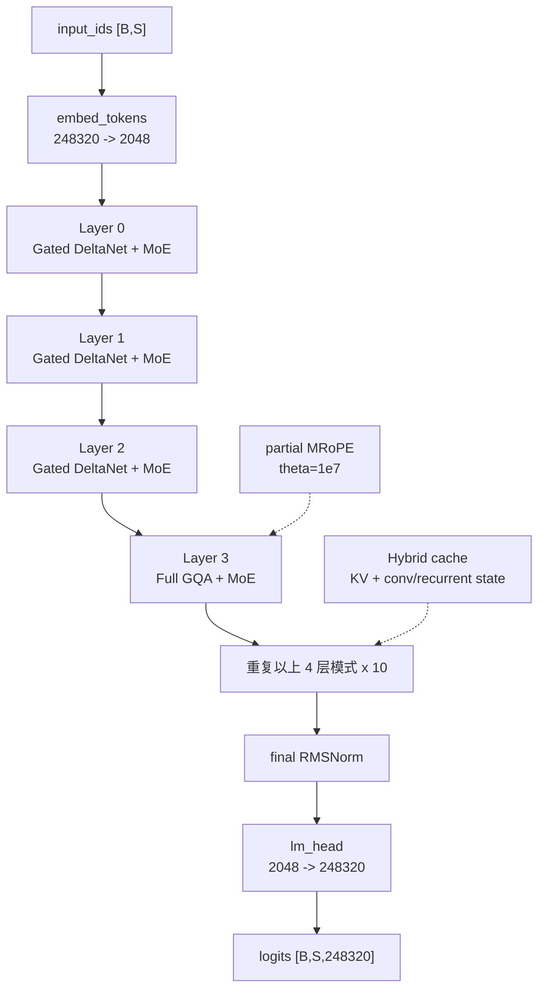
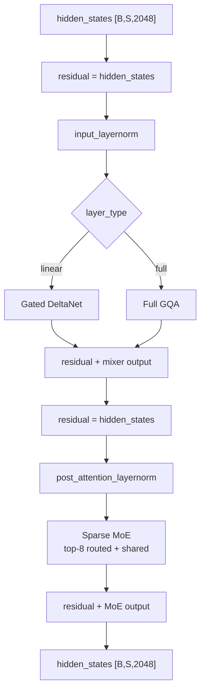

# Qwen3.6-35B-A3B-FP8 架构结构图（ASC）

> 状态：按照 DeepSeek 模型分析粒度重写；结构与工程口径已确认。  
> 基于官方 [`config.json`](./config/Qwen3.6-35B-A3B-FP8-config.json) 与
> Hugging Face `transformers` 主分支
> `transformers/models/qwen3_5_moe/{configuration_qwen3_5_moe.py, modeling_qwen3_5_moe.py}`
> 核对。checkpoint 的 `model_type` 仍为 `qwen3_5_moe`，因此 Qwen3.6
> 使用这套运行时类。  
> 模型是多模态条件生成模型；本文及计算器仅覆盖文本 decoder，不包含视觉编码器、
> 图像 token 预处理和 MTP speculative decoding。FP8 checkpoint 与 Base
> 共享同一 decoder 拓扑，差异集中在权重存储、动态 activation 量化和
> `modules_to_not_convert` 边界。

---

## 1. 顶层结构（Top-level）

官方架构类是 `Qwen3_5MoeForConditionalGeneration`。多模态 wrapper 包含视觉塔和
语言模型；文本计算路径可归纳为：

| 组件 | 类型 / 形状 | 说明 |
|---|---|---|
| `model.visual` | `Qwen3_5MoeVisionModel` | 27 层视觉编码器；本文不计 |
| `model.language_model.embed_tokens` | `Embedding(248320, 2048)` | 文本 token embedding |
| `model.language_model.layers` | `ModuleList[Qwen3_5MoeDecoderLayer]` | 共 40 层 |
| `model.language_model.norm` | `Qwen3_5MoeRMSNorm` | 最终 RMSNorm |
| `model.language_model.rotary_emb` | Rotary Embedding | Full Attention 层使用 |
| `lm_head` | `Linear(2048, 248320)` | `tie_word_embeddings=false` |

纯文本数据流：

```text
input_ids [B,S]
  -> embed_tokens                         [B,S,2048]
  -> decoder layers x 40                 [B,S,2048]
  -> final RMSNorm                       [B,S,2048]
  -> lm_head                             [B,S,248320]
```

### 1.1 关键超参（取自 config）

| 字段 | 值 | 含义 |
|---|---:|---|
| `hidden_size` | 2048 | 隐层维度 `D` |
| `num_hidden_layers` | 40 | decoder 层数 |
| `num_attention_heads` | 16 | Full Attention query heads |
| `num_key_value_heads` | 2 | Full Attention KV heads |
| `head_dim` | 256 | 单头维度 `c` |
| `attn_output_gate` | true | Q 投影同时产生 output gate |
| `full_attention_interval` | 4 | 每 4 层一个 Full Attention |
| `linear_num_key_heads` | 16 | DeltaNet key heads |
| `linear_key_head_dim` | 128 | DeltaNet key head dim |
| `linear_num_value_heads` | 32 | DeltaNet value heads |
| `linear_value_head_dim` | 128 | DeltaNet value head dim |
| `linear_conv_kernel_dim` | 4 | depthwise causal Conv1D kernel |
| `num_experts` | 256 | routed experts |
| `num_experts_per_tok` | 8 | 每 token 选择的 routed experts |
| `moe_intermediate_size` | 512 | routed expert 中间维度 |
| `shared_expert_intermediate_size` | 512 | shared expert 中间维度 |
| `hidden_act` | `silu` | SwiGLU gate 激活 |
| `max_position_embeddings` | 262144 | 最大文本上下文 |
| `partial_rotary_factor` | 0.25 | 仅部分 head dim 使用 RoPE |
| `rope_theta` | 10000000 | RoPE 基频 |
| `mrope_section` | `[11,11,10]` | 多模态位置分段 |
| `mamba_ssm_dtype` | `float32` | 线性注意力状态精度提示 |
| `mtp_num_hidden_layers` | 1 | checkpoint MTP 元数据；本文不计 |
| `tie_word_embeddings` | false | embedding 与 lm_head 不共享 |

### 1.2 Attention 层 schedule

`layer_types` 在 checkpoint 中显式给出，长度为 40：

```text
[linear_attention, linear_attention, linear_attention, full_attention] x 10
```

| 类型 | 层数 | 层索引 |
|---|---:|---|
| `linear_attention` | 30 | 每组的前 3 层 |
| `full_attention` | 10 | 3, 7, 11, ..., 39 |

本地校验脚本已验证 schedule 长度、类型计数与 `num_hidden_layers` 一致。

### 1.3 MLP 层 schedule

40 个 decoder 层全部使用相同的 `Qwen3_5MoeSparseMoeBlock`：

```text
top-8 routed experts + 1 gated shared expert
```

没有 dense-MLP 层，也没有 DeepSeek V4 的 Hash-MoE bootstrap。

---

## 2. 架构总览图

### 2.1 Mermaid 图



### 2.2 ASCII 字符图

```text
                         Qwen3_5MoeForConditionalGeneration
┌────────────────────────────────────────────────────────────────────────────┐
│                                                                            │
│  input_ids [B,S]                                                           │
│       │                                                                    │
│       ▼                                                                    │
│  embed_tokens (248320 -> 2048)                                             │
│       │                                                                    │
│       ▼                                                                    │
│  ┌──────────────────────────────────────────────────────────────────────┐  │
│  │ language_model.layers x 40                                          │  │
│  │                                                                      │  │
│  │  L0  Linear Attention + top-8 Routed MoE + Shared Expert            │  │
│  │  L1  Linear Attention + top-8 Routed MoE + Shared Expert            │  │
│  │  L2  Linear Attention + top-8 Routed MoE + Shared Expert            │  │
│  │  L3  Full GQA        + top-8 Routed MoE + Shared Expert             │  │
│  │                         repeat x 10                                  │  │
│  │                                                                      │  │
│  │  attention schedule: 30 Linear / 10 Full                            │  │
│  │  MLP schedule:       40 MoE                                          │  │
│  └─────────────────────────────────┬────────────────────────────────────┘  │
│                                    ▼                                       │
│                              final RMSNorm                                 │
│                                    │                                       │
│                                    ▼                                       │
│                         lm_head (2048 -> 248320)                            │
│                                    │                                       │
│                                    ▼                                       │
│                         logits [B,S,248320]                                 │
└────────────────────────────────────────────────────────────────────────────┘
```

---

## 3. 单个 `Qwen3_5MoeDecoderLayer` 内部残差

源码在构造时读取 `config.layer_types[layer_idx]`：

```text
linear_attention -> Qwen3_5MoeGatedDeltaNet
full_attention   -> Qwen3_5MoeAttention
all layers       -> Qwen3_5MoeSparseMoeBlock
```

### 3.1 Mermaid 图



### 3.2 源码等价流程

```text
residual = hidden_states
hidden_states = input_layernorm(hidden_states)

if block_type == "linear_attention":
    hidden_states = linear_attn(hidden_states, cache)
else:
    hidden_states = self_attn(hidden_states, position_embeddings, cache)

hidden_states = residual + hidden_states

residual = hidden_states
hidden_states = post_attention_layernorm(hidden_states)
hidden_states = sparse_moe(hidden_states)
hidden_states = residual + hidden_states
```

与 DeepSeek V4 不同，这里是标准单流 Pre-Norm 双残差，不存在 mHC 多流残差。

---

## 4. `Qwen3_5MoeAttention`（Full GQA）内部

### 4.1 投影路径与维度

| 路径 | Linear | 输出形状 |
|---|---|---|
| Q + gate | `2048 -> 16*256*2 = 8192` | Q `[B,16,S,256]` + gate `[B,S,4096]` |
| K | `2048 -> 2*256 = 512` | K `[B,2,S,256]` |
| V | `2048 -> 2*256 = 512` | V `[B,2,S,256]` |
| Output | `4096 -> 2048` | `[B,S,2048]` |

Q/K 在单头维度上执行 RMSNorm。K/V 通过 GQA 在计算时从 2 个 KV heads
逻辑扩展到 16 个 query heads，永久 cache 仍保存 2 个 KV heads。

### 4.2 内部数据流

```text
hidden [B,S,2048]
  ├─ q_proj -> split(Q, gate)
  │    Q -> q_norm -> partial RoPE
  ├─ k_proj -> k_norm -> partial RoPE -> KV cache
  └─ v_proj --------------------------> KV cache

repeat_kv(2 -> 16 heads)
  -> QK^T / sqrt(256)
  -> causal mask
  -> softmax(fp32)
  -> attention weights @ V
  -> sigmoid(gate) * attention output
  -> o_proj
```

### 4.3 Full Attention 特性

- causal attention
- GQA ratio：`16 / 2 = 8`
- Q/K per-head RMSNorm
- attention output gate
- 支持 eager / SDPA / FlashAttention 接口
- 只有 10 层产生随上下文长度增长的 KV Cache

---

## 5. `Qwen3_5MoeGatedDeltaNet` 内部

### 5.1 关键维度

```text
key_dim   = 16 * 128 = 2048
value_dim = 32 * 128 = 4096
conv_dim  = 2*key_dim + value_dim = 8192
```

| 投影 | 形状 |
|---|---|
| `in_proj_qkv` | `2048 -> 8192` |
| `in_proj_z` | `2048 -> 4096` |
| `in_proj_a` | `2048 -> 32` |
| `in_proj_b` | `2048 -> 32` |
| depthwise `conv1d` | channels=8192, kernel=4, groups=8192 |
| `out_proj` | `4096 -> 2048` |

### 5.2 内部数据流

```text
hidden [B,S,2048]
  ├─ in_proj_qkv -> [Q(2048), K(2048), V(4096)]
  │    -> depthwise causal Conv1D(kernel=4)
  ├─ in_proj_z -> Z(4096)
  ├─ in_proj_b -> beta = sigmoid(b)
  └─ in_proj_a -> g = -exp(A_log) * softplus(a + dt_bias)

Q/K heads 16 -> repeat_interleave -> 32 value heads
  -> chunk gated-delta rule (prefill)
     or recurrent gated-delta rule (single-token decode)
  -> gated RMSNorm(core_output, Z)
  -> out_proj
```

### 5.3 recurrent update

源码的逐 token 语义可写成：

```text
state_t = state_(t-1) * exp(g_t)
memory_t = state_t * k_t
delta_t = (v_t - memory_t) * beta_t
state_t = state_t + outer(k_t, delta_t)
output_t = state_t * q_t
```

Prefill 使用 chunk kernel；有历史状态且 `seq_len=1` 时使用 recurrent kernel。
30 个线性层只维护固定大小的 conv state 与 recurrent state，不保存完整历史 KV。

---

## 6. `Qwen3_5MoeSparseMoeBlock` 内部

### 6.1 Router

```text
router_logits = Linear(2048 -> 256)
router_probs  = softmax(router_logits, fp32)
top-8         = topk(router_probs, 8)
top-8 weights = normalize(sum=1)
```

训练时可通过 `router_aux_loss_coef=0.001` 计算负载均衡辅助损失。

### 6.2 Routed experts

每个 routed expert 是 SwiGLU：

```text
gate_up_proj: 2048 -> 2*512
gate, up = split(...)
hidden = SiLU(gate) * up
down_proj: 512 -> 2048
```

每 token 只执行 256 个 routed experts 中选出的 8 个，再按 router 权重加权求和。

### 6.3 Shared expert

```text
shared = SharedSwiGLU(2048 -> 512 -> 2048)
shared_gate = sigmoid(Linear(2048 -> 1))
output = routed_output + shared_gate * shared
```

因此 FLOPs 口径按 `8 routed + 1 shared` 计算，而不是只按 top-8。

---

## 7. Cache 设计

这是 hybrid cache，而不是 40 层统一 KV Cache。

| 层类型 | 持久状态 | 是否随 `S_ctx` 增长 |
|---|---|---|
| 10 Full Attention | K + V，2 KV heads，head_dim=256 | 是 |
| 30 Linear Attention | Conv1D state `[conv_dim,4]` | 否 |
| 30 Linear Attention | recurrent state `[32,128,128]` | 否 |

### 7.1 Full Attention KV Cache

```text
K,V per layer: [B, 2, S_ctx, 256]
```

### 7.2 Linear Attention state

```text
conv_state per layer:
  B * conv_dim * kernel

recurrent_state per layer:
  B * value_heads * key_head_dim * value_head_dim
```

源码在 cached single-token decode 中原地更新 conv state，并用 recurrent kernel 更新
recurrent state。

---

## 8. RoPE 与位置编码

RoPE 只用于 10 个 Full Attention 层；Gated DeltaNet 不消费完整 KV 位置序列。

配置：

```text
head_dim = 256
partial_rotary_factor = 0.25
rotary_dim = 64
pass-through dim = 192
rope_theta = 10,000,000
mrope_section = [11,11,10]
mrope_interleaved = true
```

每个 Q/K head：

```text
[RoPE 64 dims | pass-through 192 dims]
```

`apply_rotary_pos_emb` 只旋转前 `rotary_dim`，其余维度原样拼回。

---

## 9. 文本 forward 数据流

```text
input_ids [B,S]
  -> embed_tokens [B,S,2048]
  -> build causal mask for Full Attention layers
  -> build / reuse hybrid cache
  -> rotary embeddings
  -> for layer in 0..39:
       RMSNorm
       GatedDeltaNet or FullGQA
       residual add
       RMSNorm
       SparseMoE
       residual add
  -> final RMSNorm
  -> lm_head [B,S,248320]
```

Router logits 只在请求输出或训练辅助损失时保留。checkpoint 声明一个 MTP 层，但
Transformers 的 CausalLM 路径允许忽略对应额外权重；本文不计 MTP。

---

## 10. 量化 / 部署相关

### 10.1 官方 FP8 配置

```text
quant_method       = fp8
fmt                = e4m3
activation_scheme  = dynamic
weight_block_size  = [128, 128]
text dtype         = bfloat16
```

FP8改变的是支持量化的GEMM权重和运行时GEMM输入，不改变模型拓扑或
理论FLOPs。`activation_scheme=dynamic`不等于hidden、residual、
KV cache和recurrent state均永久用1 byte存储。

### 10.2 完整排除清单

官方配置包含648个`modules_to_not_convert`条目：

| 分类 | 条目数 |
|---|---:|
| Visual相关 | 246 |
| Language decoder layers | 390 |
| MTP | 10 |
| Embedding / LM head | 2 |
| 名称包含norm | 145 |
| Router/shared gates | 82 |
| Linear state/control modules | 210 |

典型非FP8模块包括embedding、lm_head、各类Norm、MoE router、
shared-expert gate，以及DeltaNet的`A_log`、`dt_bias`、Conv1D、
`in_proj_a/b/ba`与gated norm。Routed expert主矩阵未出现在排除清单，
是FP8权重压缩的主要受益部分。

### 10.3 推荐计算器精度

- 普通权重：1 B/param
- routed expert权重：1 B/param
- activation / Full KV cache：2 B/elem（BF16）
- DeltaNet recurrent state：4 B/elem（FP32）
- 动态FP8 activation通过平台FP8吞吐和效率体现，不把cache改为1 byte
- `tie_word_embeddings=false`
- 可使用 FlashAttention / SDPA；实际可用性取决于运行时版本和 kernel
- 快速线性注意力路径依赖 flash-linear-attention 与 causal-conv1d
- 缺少快速 kernel 时 Transformers 会回退到 PyTorch 实现

### 10.4 checkpoint体积与部署边界

官方仓库42个safetensors文件合计`37.463662160 GB`。该体积包含visual、
MTP、非FP8tensor、量化scale和metadata；计算器只覆盖文本decoder，
因此默认不直接以完整checkpoint体积替代文本参数估算。

计算器未计：

- 视觉塔与多模态预处理
- MTP speculative decoding
- Router、RMSNorm、RoPE、采样等小算子
- TP / EP 通信
- allocator fragmentation 与额外 workspace

---

## 11. 关键超参速查表

| 符号 | 配置字段 | 值 |
|---|---|---:|
| `S` | 128K 分析序列长度 | 131072 |
| `D` | `hidden_size` | 2048 |
| `L` | `num_hidden_layers` | 40 |
| `L_full` | Full Attention layers | 10 |
| `L_linear` | Linear Attention layers | 30 |
| `n_h` | `num_attention_heads` | 16 |
| `n_kv` | `num_key_value_heads` | 2 |
| `c` | `head_dim` | 256 |
| `n_kh` | `linear_num_key_heads` | 16 |
| `c_k` | `linear_key_head_dim` | 128 |
| `n_vh` | `linear_num_value_heads` | 32 |
| `c_v` | `linear_value_head_dim` | 128 |
| `K_conv` | `linear_conv_kernel_dim` | 4 |
| `E` | `num_experts` | 256 |
| `k` | `num_experts_per_tok` | 8 |
| `I` | `moe_intermediate_size` | 512 |
| `I_shared` | `shared_expert_intermediate_size` | 512 |

---

## 12. Prefill 阶段算力估算（128K）

> `S=128*1024=131072`。1 次 multiply-add = 2 FLOPs。忽略 norm、RoPE、
> router topk 等小项。

### 12.1 Full Attention 单层模板

#### (1) Q + output gate

```text
F_Qgate = 2*S*D*(2*n_h*c)
```

#### (2) K / V

```text
F_KV = 2 * [2*S*D*n_kv*c]
```

#### (3) causal attention core

Prefill causal 有效 pair 约为 `S²/2`，QK 与 AV 各一次：

```text
F_core = 2*S²*n_h*c
```

#### (4) output projection

```text
F_O = 2*S*(n_h*c)*D
```

#### (5) MoE

SwiGLU 每个专家包含 gate、up、down 三个矩阵：

```text
F_MoE = 6*S*D*I*(k+1)
```

### 12.2 Linear Attention 单层模板

```text
key_dim   = n_kh*c_k = 2048
value_dim = n_vh*c_v = 4096
conv_dim  = 2*key_dim + value_dim = 8192

F_qkv  = 2*S*D*conv_dim
F_z    = 2*S*D*value_dim
F_ab   = 2*S*D*(2*n_vh)
F_conv = 2*K_conv*S*conv_dim
F_scan = 2*S*n_vh*c_k*c_v
F_O    = 2*S*value_dim*D
F_MoE  = 6*S*D*I*(k+1)
```

### 12.3 代入 128K 数值

| 分项 | 单层 | 层数 | 全部对应层 |
|---|---:|---:|---:|
| Full Q + gate | 4.40 T | 10 | 43.98 T |
| Full K/V | 0.55 T | 10 | 5.50 T |
| Full causal core | 140.74 T | 10 | 1,407.37 T |
| Full output | 2.20 T | 10 | 21.99 T |
| Full MoE | 7.42 T | 10 | 74.22 T |
| Linear projections | 6.63 T | 30 | 198.94 T |
| Linear Conv1D | 0.009 T | 30 | 0.26 T |
| Linear recurrent scan | 0.137 T | 30 | 4.12 T |
| Linear output | 2.20 T | 30 | 65.97 T |
| Linear MoE | 7.42 T | 30 | 222.65 T |

### 12.4 两类层合计

| 层类型 | 单层 | 层数 | 合计 |
|---|---:|---:|---:|
| Full Attention + MoE | 155.31 T | 10 | 1,553.06 T |
| Gated DeltaNet + MoE | 16.40 T | 30 | 491.95 T |
| **全模型 Prefill** | - | 40 | **2,045.01 T = 2.045 PFLOPs** |

### 12.5 FLOPs 占比

| 分项 | 占比 |
|---|---:|
| Full causal core | 68.82% |
| Linear MoE | 10.89% |
| Linear projections | 9.73% |
| Full MoE | 3.63% |
| Linear output | 3.23% |
| Full Q + gate | 2.15% |
| 其他 | 1.55% |

128K 下的主导项是 10 个 Full Attention 层的 `O(S²)` causal core。

---

## 13. Decode 阶段内存需求公式（128K）

> `B=1`，初始上下文 `S_ctx=131072`。量化权重按FP8；KV/activation
> 使用BF16；recurrent state使用FP32。

### 13.1 总公式

```text
M_decode_total
  ≈ M_weights
  + M_full_kv
  + M_linear_state
  + M_decode_tmp_peak
  + M_runtime_overhead
```

### 13.2 权重常驻

官方配置不提供精确参数分组。计算器当前采用可追溯假设：

```text
N_total  = 34.66B
N_expert = 32.36B
```

FP8文本参数简化口径：

```text
M_weights
  = N_nonexpert * 1
  + N_expert * 1
  = 34.66 GB
```

完整官方safetensors为37.464 GB，但包含本文不计算的visual和MTP，
也包含非FP8tensor、scale与metadata。默认计算口径仍为34.660 GB。

### 13.3 持久 Full Attention KV Cache

```text
M_full_kv
  = L_full * B * 2(K+V) * n_kv * S_ctx * c * e
  = 10 * 1 * 2 * 2 * 131072 * 256 * 2
  = 2.684 GB
```

### 13.4 持久 Linear Attention state

Conv state：

```text
M_conv
  = 30 * B * conv_dim * K_conv * 2
```

Recurrent state：

```text
M_recurrent
  = 30 * B * n_vh * c_k * c_v * 4
```

合计：

```text
M_linear_state ≈ 0.065 GB
```

因此持久 cache 总计：

```text
M_decode_cache = 2.684 + 0.065 = 2.749 GB
```

### 13.5 单步临时工作集

eager GQA 可能把 2 个 KV heads 临时扩展到 16 个 query heads：

```text
M_tmp
  ≈ B * 2(K+V) * e * n_h * (S_ctx+1) * c
  ≈ 2.148 GB
```

这是最宽 Full Attention 层的瞬时张量近似，不与每层同时常驻。

### 13.6 Decode 单 token 计算与流量

| 项目 | 128K 结果 |
|---|---:|
| 单 Full 层 | 2.259 GFLOPs/token |
| 单 Linear 层 | 0.125 GFLOPs/token |
| 全 40 层 | 26.340 GFLOPs/token |

当前计算器的 active weight traffic：

```text
M_active_weights
  = N_nonexpert*1
  + N_expert*(8/256)*1
  = 3.311 GB/token
```

再加 cache 读取：

```text
M_cache_read ≈ 2.718 GB/token
M_decode_traffic ≈ 6.029 GB/token
```

实际流量取决于 batch、专家复用、L2/HBM cache 命中和并行策略。

### 13.7 128K 合并口径

```text
runtime_overhead = max(4 GB, M_weights*3%) = 4 GB
```

| 组成 | 数值 |
|---|---:|
| FP8 text-decoder weight estimate | 34.660 GB |
| Full KV Cache | 2.684 GB |
| Linear conv/recurrent state | 0.065 GB |
| Single-step temp peak | 2.148 GB |
| Runtime overhead | 4.000 GB |
| **Estimated total** | **43.557 GB** |

若仅作部署提示，以完整checkpoint体积替代34.660 GB：

```text
37.464 + 2.684 + 0.065 + 2.148 + 4.000
= 46.361 GB
```

---

## 14. 引用源与已确认工程口径

### 14.1 引用源

- 官方配置：
  `docs/Qwen_3.6/config/Qwen3.6-35B-A3B-FP8-config.json`
- 官方模型页：
  `https://huggingface.co/Qwen/Qwen3.6-35B-A3B-FP8`
- Hugging Face Transformers：
  - `transformers/models/qwen3_5_moe/configuration_qwen3_5_moe.py`
  - `transformers/models/qwen3_5_moe/modeling_qwen3_5_moe.py`
- 本地配置校验：
  `scripts/analyze_qwen36_config.py`

运行：

```powershell
python scripts/analyze_qwen36_config.py `
  docs/Qwen_3.6/config/Qwen3.6-35B-A3B-FP8-config.json `
  --expect-layers 40 `
  --expect-full-layers 10 `
  --expect-linear-layers 30
```

### 14.2 已确认工程口径

1. 只计算文本 decoder，不计视觉编码器与 MTP。
2. FP8 checkpoint使用FP8普通/专家权重、BF16 activation/cache。
3. 暂采用 `N_total=34.66B`、`N_expert=32.36B` 的参数估算。
4. Prefill causal core 使用 `2*S²*n_h*c`。
5. 128K Prefill 总量采用 `2.045 PFLOPs`。
6. Decode compute采用`26.340 GFLOPs/token`。
7. Active weight traffic采用`3.311 GB/token`。
8. 128K、Batch 1总运行时内存采用`43.557 GB`。
9. 完整checkpoint的`37.464 GB`与`46.361 GB`总显存只作部署提示。
