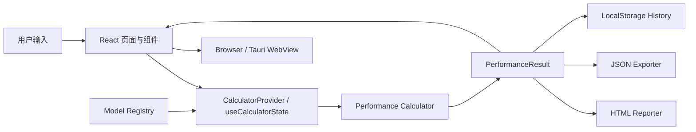

# LLM Perf Calculator 代码设计文档

## 1. 文档信息

| 项目 | 内容 |
| --- | --- |
| 用途 | 团队代码设计归档、维护交接和新成员入门 |
| 工程 | `llm-perf-calculator` |
| 技术栈 | React 18、TypeScript、Vite、Tauri 2 |
| 运行形态 | 浏览器应用、Tauri 桌面应用 |
| 计算特点 | 客户端本地解析公式，不依赖在线推理服务 |
| 更新日期 | 2026-08-11 |

本文描述通用代码架构、核心数据流、计算引擎、扩展机制和验收要求。逐模型结构参数、公式推导和基线数值记录在对应模型分析文档中，不在本文展开。

## 2. 设计目标

系统根据模型结构、平台能力和推理负载，估算：

- Prefill 理论计算量、TPS 和 TTFT；
- 初始 Decode TPS、平均 Decode TPS 和输出耗时；
- 权重、持久 Cache、临时工作集、运行时开销及峰值显存；
- Compute-bound 与 Bandwidth-bound 瓶颈；
- 不同 Token 长度下的性能趋势；
- 可追溯公式、中间量、HTML 报告和 JSON 快照。

核心原则：

1. **公式可追溯**：结果能回溯到模型参数、平台参数、负载和中间公式。
2. **模型可扩展**：模型通过注册表与公式策略接入，页面不手写模型列表。
3. **计算与界面分离**：页面负责展示，计算服务保持纯函数特征。
4. **Web/Desktop 同源**：浏览器与 Tauri 共用 React、状态和计算逻辑。
5. **本地优先**：计算、历史和报告生成均在客户端完成。

## 3. 总体架构



系统没有业务后端。模型注册、公式计算、报告生成和历史记录均运行在浏览器或 Tauri WebView 中。

## 4. 目录与职责

```text
src/
├── app/                                  应用入口、布局、路由和全局样式
├── components/                           跨页面通用组件
├── domain/                               稳定业务类型
│   ├── history/
│   ├── model/
│   ├── performance/
│   ├── platform/
│   └── workload/
├── engines/
│   ├── model-registry/                   模型注册和 family 查询
│   └── formula-strategies/               公式策略预留目录
├── features/
│   ├── history/services/                 历史记录持久化
│   └── performance-calculator/
│       ├── components/                   计算器业务组件
│       ├── services/                     计算、HTML、JSON
│       ├── state/                        共享状态和动作
│       └── utils/                        公式定位等辅助逻辑
└── pages/                                页面装配层

data/
├── models/                               模型结构事实和验收数据
└── platform-presets/                     平台预设

docs/                                     设计、使用说明和模型分析
scripts/                                  基线校验和报告验证
src-tauri/                                Tauri 桌面宿主
```

依赖方向：

```text
pages/components
      ↓
features/state/services
      ↓
domain + model-registry
```

约束：

- `domain` 不依赖页面、组件或浏览器 API；
- 模型注册表不依赖页面；
- 页面不保存模型结构常量；
- 核心公式不散落在 JSX 中。

## 5. 启动、路由与页面生命周期

入口为 `src/main.tsx`。`src/app/routes/router.tsx` 使用 Hash Router，以兼容静态托管和 Tauri WebView。

`src/app/App.tsx` 定义四个常驻页面：

- `/performance-calculator`：性能计算；
- `/model-structure`：模型结构；
- `/formula-notes`：公式说明；
- `/history`：历史记录。

根路径重定向到性能计算页。页面采用常驻挂载、通过 `hidden` 切换显示的方式，导航时不销毁页面局部状态。所有页面位于同一个 `CalculatorProvider` 内。

## 6. 核心领域模型

### 6.1 ModelDefinition

定义位置：`src/domain/model/types.ts`。

| 类别 | 典型字段 | 用途 |
| --- | --- | --- |
| 标识 | `family`、`id`、`displayName` | family/model 两段式选择 |
| 架构判别 | `architectureKind` | 控制结构页展示 |
| 公式判别 | `formulaStrategyId` | 选择计算与报告模板 |
| 来源 | `configSource`、参数及权重 URL | 参数追溯 |
| 精度建议 | `recommendedPrecision` | 初始化平台精度 |
| 通用结构 | 层数、Hidden Size、Heads、Head Dim | Attention/FFN 计算 |
| MoE 结构 | Expert 数、激活数、Expert 宽度 | MoE FLOPs 与带宽 |
| Attention 结构 | Sliding、Full、Linear、Compressed 等字段 | Cache 与 FLOPs |
| 参数规模 | 总参数、Expert 参数等 | 权重显存和流量 |

当前类型是兼容多架构的宽接口，部分字段对某些架构无意义。长期应重构为以 `architectureKind` 为判别字段的联合类型。

### 6.2 PlatformInput

定义位置：`src/domain/platform/types.ts`。

```ts
type PlatformInput = {
  computeThroughputTflops: number;
  memoryBandwidthGbps: number;
  memoryCapacityGb: number;
  computeEfficiency: number;
  bandwidthEfficiency: number;
  prefillCacheTrafficFactor: number;
  batchSize: number;
  runtimeOverheadGb: number;
  bytesPerWeight: number;
  bytesPerActivation: number;
  bytesPerExpert: number;
};
```

硬件峰值与利用率分开保存：峰值表示理论能力，利用率表示对当前工作负载的工程假设。

### 6.3 WorkloadInput

定义位置：`src/domain/workload/types.ts`。

```ts
type WorkloadInput = {
  prefillTokenLength: number;
  decodeOutputTokens: number | null;
  tokenRangeStart: number;
  tokenRangeEnd: number;
  tokenRangeStep: number;
  tokenSweepMode: "fixed-step";
};
```

`decodeOutputTokens=null` 时由状态层解析为 Prompt 长度。Token Sweep 用于趋势图和报告预测表。

### 6.4 PerformanceResult

定义位置：`src/domain/performance/types.ts`。

统一结果对象包含：

- `summary`：顶部摘要指标；
- `comparisonRows`：Prefill/Decode 对照；
- `memoryBreakdown`：显存分项；
- `intermediateMetrics`：中间量；
- `formulaTrace`：公式追溯；
- `tokenSweepSeries`：趋势数据；
- `projectionSeries`：报告标准场景预测。

页面、历史和导出服务只消费统一结果，不重复实现核心公式。

## 7. 状态设计

入口：

- `src/features/performance-calculator/state/CalculatorProvider.tsx`
- `src/features/performance-calculator/state/useCalculatorState.ts`

共享状态包括模型选择、平台参数、工作负载、显示开关、校验错误、最近一次正式结果、计算快照和历史记录。

### 7.1 输入与正式结果隔离

用户修改输入时可以产生预览，但正式结果只在点击计算且校验通过后更新。正式计算同时保存不可变快照，用于：

- 保证 HTML/JSON 与当次计算一致；
- 避免输入修改后旧结果被误标为新结果；
- 写入历史；
- 同步公式页和结构页到本次计算模型。

### 7.2 模型切换

模型切换流程：

1. 从注册表读取目标模型；
2. 更新 Model ID；
3. 应用模型推荐的 Weight、Activation 和 Expert 精度；
4. 保留其余可编辑平台参数；
5. 重新校验输入。

### 7.3 快捷输入

快捷 Token 按钮通过 `QuickRangeTarget` 指向当前获得焦点的输入框。状态层统一写入数值，组件只负责切换目标和触发动作。

## 8. 模型注册设计

统一入口：`src/engines/model-registry/index.ts`。

注册表提供：

- `modelRegistry`：所有模型定义；
- `getModelFamilies()`：生成 family 选项；
- `getModelsByFamily()`：按 family 查询；
- `getModelDefinition()`：按 ID 查找，不存在时抛错。

模型按 family 拆分到独立文件。新增模型不能只增加下拉框选项，还必须确认架构展示、公式策略、参数来源、推荐精度、结构分析和基线校验。

## 9. 计算引擎

核心文件：`src/features/performance-calculator/services/performanceCalculator.ts`。

```ts
calculatePerformanceResult(
  model: ModelDefinition,
  platform: PlatformInput,
  workload: WorkloadInput
): PerformanceResult
```

### 9.1 策略分派

计算器依据 `formulaStrategyId` 选择架构口径，当前包含：

- `deepseek-v4-compressed-moe`；
- `dense-decoder-transformer`；
- `dense-decoder-moe`；
- `hybrid-linear-moe`；
- `hybrid-linear-dense`。

未知策略必须报错，不能回退到近似公式。

### 9.2 Prefill

```text
F_prefill = Σ(layer_count × layer_flops) + architecture_specific_flops
```

矩阵乘法统一按 `2 × M × N × K` FLOPs。Causal Full Attention 只计算下三角有效 Token 对。

```text
compute_ceiling   = effective_compute × S / F_prefill
bandwidth_ceiling = effective_bandwidth × S / B_prefill
prefill_tps       = min(compute_ceiling, bandwidth_ceiling)
ttft              = S / prefill_tps
```

### 9.3 Decode

Decode 每步计算量由投影、Attention Core、FFN/MoE及架构特有算子组成：

```text
B_decode = B_weight_per_token + B_cache_per_token

decode_compute_ceiling   = effective_compute / F_decode_per_token
decode_bandwidth_ceiling = effective_bandwidth / B_decode
decode_tps               = min(decode_compute_ceiling, decode_bandwidth_ceiling)
```

MoE 的权重流量按非 Expert 权重加激活 Expert 比例估算，不能按全部 Expert 每 Token 读取。

### 9.4 显存

```text
M_total = M_weights
        + M_persistent_cache
        + M_temporary_peak
        + M_runtime_overhead
```

- `M_weights`：常驻权重；
- `M_persistent_cache`：跨 Decode 步骤保存的 KV Cache 或线性状态；
- `M_temporary_peak`：单步 Attention 和 Kernel 工作集峰值；
- `M_runtime_overhead`：框架、Allocator 和运行时开销假设。

### 9.5 输出区间

平均 Decode TPS 不是直接使用初始 TPS。计算器在 Prompt 到最终上下文间最多采样 256 个位置，累计单步延迟并外推完整耗时：

```text
decode_time = Σ(1 / step_tps)
average_tps = output_tokens / decode_time
```

同时以最终上下文重新计算峰值显存。

### 9.6 Token Sweep

趋势图按固定步长生成离散点，每个点重新执行完整公式，不对首尾结果做线性插值。

## 10. 公式追溯

`formulaTrace` 按 `prefill`、`decode`、`memory` 三类组织。每行包含标签、公式、代入结果和可选来源链接。

公式说明页消费同一份 Trace，不重新计算。`formulaTraceTargets.ts` 提供跨页面定位规则。

## 11. UI 组件

| 组件 | 职责 |
| --- | --- |
| `CalculatorControls` | 模型、平台、负载、快捷输入 |
| `MetricCards` | TTFT、TPS、显存摘要 |
| `ComparisonTable` | Prefill/Decode 对照 |
| `MemoryBreakdownCard` | 显存分项 |
| `IntermediateMetricsTable` | 中间量 |
| `FormulaTraceCard` | 本次公式代入 |
| `TrendChart` | Token Sweep 趋势 |

结构页按 `architectureKind` 展示，不按具体 Model ID 写分支；公式页按 `formulaStrategyId` 选择说明。

## 12. 报告与导出

### 12.1 HTML

`performanceHtmlReporter.ts` 接收：

```text
ModelDefinition + CalculationSnapshot + PerformanceResult
```

报告按 `formulaStrategyId` 选择架构模板，展示模型配置、计算模块、Prefill 推导、标准 Context 下的 Prefill 与 Decode 预测。

HTML 是自包含 UTF-8 文档。按钮点击时先同步打开窗口，再异步生成并写入报告，避免被浏览器拦截。

### 12.2 JSON

`performanceJsonExporter.ts` 保留模型、平台、工作负载、结果、Trace 和趋势序列，用于程序处理和审计。

## 13. 历史记录

实现：`src/features/history/services/historyStorage.ts`。

```text
localStorage key = llm-perf-calculator:calculation-history:v1
```

规则：

- 只在成功计算后写入；
- 存储失败不阻断当前计算；
- JSON 解析失败返回空记录；
- 支持删除单条和清空；
- 数据只存在于当前浏览器或桌面 WebView。

修改历史结构时应升级 Key 版本或增加迁移逻辑。

## 14. Web 与 Tauri 边界

React 业务代码不直接依赖 Tauri 专用能力。`src-tauri/` 只负责窗口、打包和宿主配置。未来若增加文件系统或原生对话框，应通过适配层封装，并提供浏览器回退。

## 15. 输入校验与错误处理

状态层统一校验：

- 数值是否有限且为正；
- 利用率范围是否合法；
- Token 起止和步长是否合法；
- 长度是否超过模型上下文；
- 精度和容量是否有效。

有错误时不得生成正式结果或历史。未知 Model ID、公式策略和报告模板必须显式抛错。

## 16. 新模型接入

### 16.1 结构分析

1. 保存官方 `config.json`；
2. 核对官方或本地 Transformers 实现；
3. 分析层 Schedule、Attention、FFN/MoE、Cache 和量化；
4. 输出结构文档；
5. 给出 Prefill、Decode 和显存基线；
6. 评审确认后进入代码适配。

### 16.2 工程适配

1. 必要时扩展 Domain 类型；
2. 在对应 Family 文件注册模型；
3. 选择或新增准确策略；
4. 接入计算分支；
5. 适配结构页和公式页；
6. 增加 HTML 模板；
7. 增加基线脚本；
8. 更新设计和使用说明；
9. 执行完整回归。

禁止只复制相似模型并修改显示名称。

## 17. 测试与验收

基础检查：

```powershell
node node_modules/typescript/lib/tsc.js -b --pretty false
npm.cmd run build
```

基线脚本位于 `scripts/`，至少覆盖：

- 固定 Token 长度的 Prefill FLOPs；
- Decode GFLOPs/token；
- 权重与 Cache 流量；
- 持久 Cache、临时峰值和总显存；
- HTML 必须出现的架构分块；
- 未知策略不得静默回退。

修改公共公式时，应运行受影响模型和至少一个未受影响模型的回归。

## 18. 构建发布

```powershell
# Web 开发
npm.cmd run dev

# Web 生产构建
npm.cmd run build

# Tauri 开发与构建
npm.cmd run desktop:dev
npm.cmd run desktop:build
```

Web 产物位于 `dist/`；Tauri 产物位于 `src-tauri/target/release/` 及其 `bundle/` 子目录。

## 19. 已知技术债务

1. 公式仍集中在较大的 `performanceCalculator.ts`，策略目录尚未真正模块化。
2. `ModelDefinition` 是宽接口，存在无关字段和零值填充。
3. 部分架构展示逻辑仍在页面，应逐步抽成 Structure Adapter。
4. 当前以公式基线脚本为主，缺少细粒度 TypeScript 单元测试。
5. Prefill 内存流量包含工程近似，需要结合目标 Runtime 校准。
6. 报告模板和计算服务分别维护算子分块，公式变化时必须同步。

建议重构顺序：

```text
拆分 ModelDefinition 联合类型
→ 拆分公式策略模块
→ 建立共享 Breakdown 数据结构
→ HTML 和页面统一消费 Breakdown
→ 补充单元测试与快照测试
```

## 20. 代码评审清单

- [ ] 模型事实来自可追溯配置或源码；
- [ ] 使用正确的 `formulaStrategyId`；
- [ ] 页面没有按 Model ID 硬编码；
- [ ] FLOPs 明确乘加和 Causal 口径；
- [ ] Decode 同时计算 Compute 与 Bandwidth Ceiling；
- [ ] 权重、Cache、临时工作集没有重复或遗漏；
- [ ] 结果进入统一 `PerformanceResult`；
- [ ] Trace 与 HTML 报告同步；
- [ ] 设计文档和模型文档已更新；
- [ ] 类型检查、构建和模型基线回归通过。

## 21. 相关文档

- [应用设计规范](./design/app-design-spec.md)
- [架构设计](./design/architecture-design.md)
- [性能计算页规范](./design/pages/performance-calculator.md)
- [模型结构页规范](./design/pages/model-structure.md)
- [公式说明页规范](./design/pages/formula-notes.md)
- [使用说明](./user-guide.md)
- [开发约束](../../AGENTS.md)

