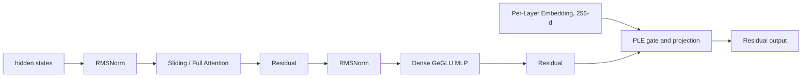

# Gemma-4-E2B-it 结构与性能口径

> 配置来源：[`gemma-4-E2B-it-config.json`](./config/gemma-4-E2B-it-config.json)。
> 实现核对：Hugging Face Transformers `main` 分支 `transformers/models/gemma4/`（核对日期：2026-08-07）。
> 本文与计算器首版一致，只分析 text-only、batch=1 推理；图像和音频编码器的计算暂不计入。

## 1. 模型定位

E2B 中的 `E` 表示 effective parameters。Google 模型卡给出的规模为约 2.3B effective parameters、约 5.1B parameters with embeddings。模型是 Dense Decoder，不是 MoE；参数量较大的主要原因是 Per-Layer Embeddings（PLE）。

## 2. 关键配置

| 字段 | 值 | 含义 |
| --- | ---: | --- |
| `hidden_size` | 1536 | 主干隐藏维度 D |
| `num_hidden_layers` | 35 | Decoder 层数 L |
| `num_attention_heads` | 8 | Query heads |
| `num_key_value_heads` | 1 | Sliding 与 Full 的 KV heads |
| `head_dim` | 256 | Sliding head dim |
| `global_head_dim` | 512 | Full head dim |
| `intermediate_size` | 6144 | 基础 Dense MLP 宽度 |
| `use_double_wide_mlp` | true | KV 共享区间使用双宽 MLP |
| `sliding_window` | 512 | Sliding window |
| `num_kv_shared_layers` | 20 | 最后 20 层复用前序同类型层的 K/V |
| `hidden_size_per_layer_input` | 256 | 每层 PLE 维度 P |
| `max_position_embeddings` | 131072 | 128K context |

层序列采用 `4 sliding + 1 full`，共 28 个 Sliding Attention 层和 7 个 Full Attention 层。最后一层为 Full Attention。

## 3. 单层数据流



PLE 的完整路径为：

1. 按 token id 从 `[vocab, L * P]` 的 packed PLE 表查表并 reshape 为 `[S, L, P]`。
2. 主 embedding 经 `D -> L*P` 全局投影，和查表结果相加。
3. 每层执行 `D -> P` gate、逐元素乘 PLE、`P -> D` projection，再与残差相加。

## 4. KV 共享与 MLP schedule

`first_kv_shared_layer_idx = 35 - 20 = 15`。

| 区间 | Sliding | Full | K/V projection 与 cache | MLP 宽度 |
| --- | ---: | ---: | --- | ---: |
| L0-L14 | 12 | 3 | 独立生成并保存 K/V | 6144 |
| L15-L34 | 16 | 4 | 按 attention 类型复用前序 K/V，无 K/V projection | 12288 |

共享层仍各自计算 Q、attention core、O projection 和 MLP；只省去 K/V projection，并且不新增持久 KV cache。

## 5. Prefill FLOPs 口径

设序列长度为 `S`，Sliding 可见长度为 `W=512`，`c_s=256`，`c_f=512`，`P=256`。

非共享 Attention 层：

```text
F_Q    = 2 * S * D * n_h * c
F_KV   = 4 * S * D * n_kv * c       # K、V 分离
F_core = 4 * S * Lkv * n_h * c      # QKᵀ 与 AV 两趟矩阵乘法
F_O    = 2 * S * n_h * c * D
```

共享 Attention 层令 `F_KV=0`。Dense MLP 为：

```text
F_MLP = 6 * S * D * I_layer
```

PLE 为：

```text
F_PLE_global = 2 * S * D * (L * P)
F_PLE_layers = L * 4 * S * D * P
```

按上述口径，128K prefill 约为 `1.493 PFLOPs`，即 `11.387 GFLOPs/token`。这是工程基线值；不包含视觉/音频编码器、RMSNorm、激活函数和采样头的小算子。

## 6. Decode 显存与带宽口径

BF16、batch=1、128K context：

- 持久 KV cache 只为 15 个非共享层保存：12 个 sliding cache + 3 个 full cache，约 `0.812 GB`。
- attention 临时峰值按 broadcast 后 Full Attention 的 K/V 工作集估算，约 `2.147 GB`。
- 权重常驻采用官方约 `5.1B parameters with embeddings`，即 BF16 约 `10.2 GB`。text backbone 按结构化权重形状估算为 `4.628569344B`，其中按行访问的普通 embedding 与 PLE 表合计 `2.751463424B`。
- Decode 每 token 的 PLE 访问只读取当前 token 对应的 packed row，不应把整张 PLE 表计为单 token 流量；PLE 的全量参数仍计入常驻权重。

## 7. 工程接入建议

- 复用 `dense-decoder-transformer` 大类，但扩展 PLE、KV 共享和分段 MLP 字段及公式。
- HTML 报告建议分为：Model Config、PLE、Dense FFN（基础/双宽）、Sliding Attention（独立/共享 KV）、Full Attention（独立/共享 KV）、Total。
- 注册 id 建议为 `gemma-4-e2b-it`，显示名为 `Gemma-4-E2B`。

## 8. 已确认工程口径

- Weight Memory 采用完整 checkpoint `5.1B`；Decode 权重流量采用 text backbone，并从全量扫描中排除按行访问的 embedding 表，只加入当前 token 对应行。
- MTP draft model 不在当前配置中，首版不计入；如需复现带 MTP 的 E2B/E4B 实测表，需要另建 draft model 参数与接受率口径。
