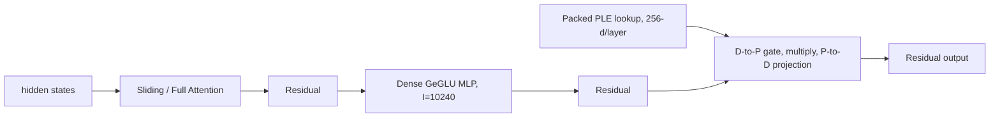

# Gemma-4-E4B-it 结构与性能口径

> 配置来源：[`gemma-4-E4B-it-config.json`](./config/gemma-4-E4B-it-config.json)。
> 实现核对：Hugging Face Transformers `main` 分支 `transformers/models/gemma4/`（核对日期：2026-08-07）。
> 本文只分析 text-only、batch=1 推理；图像和音频编码器的计算暂不计入。

## 1. 模型定位

E4B 是带 Per-Layer Embeddings（PLE）的 Dense Decoder，不是 MoE。Google 模型卡给出的规模为约 4.5B effective parameters、约 8B parameters with embeddings。

## 2. 关键配置

| 字段 | 值 | 含义 |
| --- | ---: | --- |
| `hidden_size` | 2560 | 主干隐藏维度 D |
| `num_hidden_layers` | 42 | Decoder 层数 L |
| `num_attention_heads` | 8 | Query heads |
| `num_key_value_heads` | 2 | Sliding 与 Full 的 KV heads |
| `head_dim` | 256 | Sliding head dim |
| `global_head_dim` | 512 | Full head dim |
| `intermediate_size` | 10240 | Dense GeGLU MLP 宽度 |
| `use_double_wide_mlp` | false | 无双宽 MLP 区间 |
| `sliding_window` | 512 | Sliding window |
| `num_kv_shared_layers` | 18 | 最后 18 层复用前序同类型层的 K/V |
| `hidden_size_per_layer_input` | 256 | 每层 PLE 维度 P |
| `max_position_embeddings` | 131072 | 128K context |

层序列采用 `5 sliding + 1 full`，共 35 个 Sliding Attention 层和 7 个 Full Attention 层，最后一层为 Full Attention。

## 3. 单层数据流与 PLE



PLE 包括 `[vocab, L*P]` packed embedding、主 embedding 的 `D -> L*P` 全局投影，以及每层 `D -> P -> D` 的 gated residual 路径。它既影响常驻参数，也增加 prefill/decode FLOPs。

## 4. KV 共享 schedule

`first_kv_shared_layer_idx = 42 - 18 = 24`。

| 区间 | Sliding | Full | K/V projection 与 cache |
| --- | ---: | ---: | --- |
| L0-L23 | 20 | 4 | 独立生成并保存 K/V |
| L24-L41 | 15 | 3 | 按 attention 类型复用前序 K/V，无 K/V projection |

共享层仍计算各自的 Q、attention core、O projection、Dense MLP 与 PLE 路径。

## 5. Prefill FLOPs 口径

Attention 与 PLE 公式沿用 E2B 文档；E4B 参数为 `D=2560`、`L=42`、`P=256`、`I=10240`、`W=512`，且所有层 MLP 等宽。

```text
F_Q    = 2 * S * D * n_h * c
F_KV   = 4 * S * D * n_kv * c       # 仅非共享 KV 层
F_core = 4 * S * Lkv * n_h * c      # QKᵀ 与 AV 两趟矩阵乘法
F_O    = 2 * S * n_h * c * D
F_MLP  = 6 * S * D * I

F_PLE_global = 2 * S * D * (L * P)
F_PLE_layers = L * 4 * S * D * P
```

按上述口径，128K prefill 约为 `2.046 PFLOPs`，即 `15.609 GFLOPs/token`。这是工程基线值；不包含视觉/音频编码器及 RMSNorm、激活函数等小算子。

## 6. Decode 显存与带宽口径

BF16、batch=1、128K context：

- 持久 KV cache 只为 24 个非共享层保存：20 个 sliding cache + 4 个 full cache，约 `2.168 GB`。
- attention 临时峰值按 broadcast 后 Full Attention 的 K/V 工作集估算，约 `2.147 GB`。
- 权重常驻采用官方约 `8B parameters with embeddings`，即 BF16 约 `16 GB`。text backbone 按结构化权重形状估算为 `7.463013376B`，其中按行访问的普通 embedding 与 PLE 表合计 `3.489660928B`。
- Decode 每 token 的 PLE 只读取当前 token 对应的 packed row；整张 PLE 表只计入常驻权重，不能重复当作每 token 带宽。

## 7. 工程接入建议

- 复用 `dense-decoder-transformer` 大类，同时扩展 PLE、KV 共享字段及公式。
- HTML 报告建议分为：Model Config、PLE、Dense FFN、Sliding Attention（独立/共享 KV）、Full Attention（独立/共享 KV）、Total。
- 注册 id 建议为 `gemma-4-e4b-it`，显示名为 `Gemma-4-E4B`。

## 8. 已确认工程口径

- Weight Memory 采用完整 checkpoint `8B`；Decode 权重流量采用 text backbone，并从全量扫描中排除按行访问的 embedding 表，只加入当前 token 对应行。
- MTP draft model 不在当前配置中，首版不计入；若目标是复现带 MTP 的吞吐表，需要单独提供或建模 draft checkpoint 与接受率。
